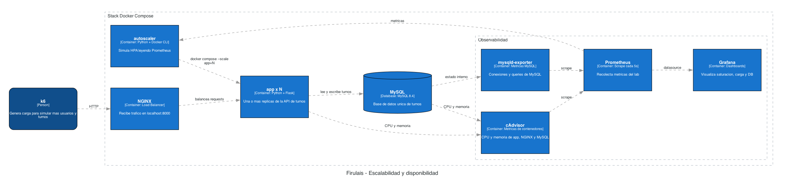

# Clínica Veterinaria Firulais - Módulo 2 Clase 2: Escalabilidad y disponibilidad

En la clase anterior hicimos **Replatform**: separamos la aplicación Flask de la base de datos MySQL y dejamos el sistema más preparado para operar.

Ahora el problema cambia:

```text
La aplicación funciona, pero ¿soporta más demanda?
```

En esta práctica vamos a simular más usuarios usando Docker Compose, NGINX, varias réplicas de la app, MySQL, k6 y Grafana.

## 1. Qué vamos a aprender

- Qué pasa cuando una sola instancia recibe más carga.
- Qué significa escalar verticalmente.
- Qué significa escalar horizontalmente.
- Para qué sirve un Load Balancer.
- Cómo observar CPU, memoria, latencia, requests y errores.
- Por qué la base de datos puede convertirse en el nuevo cuello de botella.

Idea central:

```text
Escalar no es solo agregar servidores.
Escalar es entender dónde está el límite.
```

## 2. Arquitectura



El tráfico entra por NGINX. NGINX reparte requests entre una o más réplicas de la app. Todas las réplicas usan la misma base MySQL.

## 3. Servicios principales

| Servicio | Para qué sirve |
| --- | --- |
| `app` | API Flask de turnos |
| `db` | Base de datos MySQL |
| `nginx` | Load Balancer |
| `grafana` | Dashboard para ver métricas |
| `k6-*` | Pruebas de carga |
| `autoscaler` | Demo de escalado automático |

## 4. Requisitos

Necesitás Docker con Docker Compose:

```bash
docker compose version
```

No hace falta instalar k6. k6 corre como contenedor.

## 5. Levantar el escenario base

Levantar todo con una sola réplica de la app:

```bash
docker compose up --build -d --scale app=1
```

Ver contenedores:

```bash
docker compose ps
```

Probar que la app responde:

```bash
curl http://localhost:8000/health
curl http://localhost:8000/api/turnos
curl http://localhost:8000/api/stats
```

En PowerShell, si `curl` se comporta raro, usar `curl.exe`.

## 6. URLs

```text
App:        http://localhost:8000
Health:     http://localhost:8000/health
API:        http://localhost:8000/api/turnos
Stats:      http://localhost:8000/api/stats
Grafana:    http://localhost:3001
```

Credenciales de Grafana:

```text
Grafana:     admin / admin
```

Dashboard recomendado:

```text
http://localhost:3001/d/firulais-demo/firulais-demo?from=now-30m&to=now&timezone=browser&refresh=5s
```

## 7. Pruebas de carga

k6 corre dentro de Docker Compose. Usamos `--no-deps` para que la prueba no intente levantar ni recrear la app, NGINX o MySQL.

Lecturas:

```bash
docker compose --profile k6 run --rm --no-deps k6-read
```

Carga mixta:

```bash
docker compose --profile k6 run --rm --no-deps k6-mixed
```

Estrés de app:

```bash
docker compose --profile k6 run --rm --no-deps k6-stress
```

Pico tipo lunes 9 AM:

```bash
docker compose --profile k6 run --rm --no-deps k6-peak
```

La carga mixta usa endpoints reales:

- `GET /api/turnos?limit=50`
- `POST /api/turnos`

La lectura usa un límite para que la demo de escalado horizontal mida mejor el reparto entre réplicas.

La prueba de estrés también usa endpoints reales. La app tiene un costo de CPU didáctico configurado para que se vea mejor cuándo una instancia se acerca a su límite.

## 8. PromQL básico

En Grafana se puede ir a **Explore**, elegir `Prometheus` y probar consultas simples.

CPU usada por cada réplica de la app:

```promql
sum by (name) (rate(container_cpu_usage_seconds_total{container_label_com_docker_compose_service="app"}[30s]))
```

Memoria usada por cada réplica de la app:

```promql
max by (name) (container_memory_usage_bytes{container_label_com_docker_compose_service="app"}) / 1024 / 1024
```

Requests por segundo generados por k6:

```promql
rate(k6_http_reqs_total[30s])
```

Latencia p95 medida por k6:

```promql
k6_http_req_duration_p95
```

Requests por réplica de app:

```promql
sum by (replica) (rate(k6_firulais_app_requests_by_replica_total[30s]))
```

## 9. Demo 1: una sola instancia

Dejar una sola réplica:

```bash
docker compose up --build -d --scale app=1
```

Ejecutar carga:

```bash
docker compose --profile k6 run --rm --no-deps k6-stress
```

Esta prueba usa endpoints reales y no fuerza un endpoint artificial de CPU. Si aparecen muchos `500` o `504`, la carga ya no está mostrando operación normal: está mostrando saturación.

Mirar en Grafana:

- CPU de app;
- memoria de app;
- latencia por endpoint;
- requests por endpoint;
- errores HTTP.

Idea clave:

```text
Una sola instancia puede saturarse cuando crece la demanda.
```

## 10. Demo 2: escalado vertical

Escalado vertical significa darle más recursos a la misma instancia.

Ejecutar:

```bash
docker compose -f docker-compose.yml -f docker-compose.vertical.yml up --build -d --scale app=1
```

Volver a correr la misma carga:

```bash
docker compose --profile k6 run --rm --no-deps k6-stress
```

Comparar en Grafana contra la demo anterior.

Idea clave:

```text
Escalar verticalmente puede dar más margen, pero sigue siendo una sola instancia.
```

## 11. Demo 3: escalado horizontal manual

Escalado horizontal significa agregar más réplicas. En esta demo lo hacemos manualmente para comparar con el autoscaler.

Ejecutar:

```bash
docker compose -f docker-compose.yml -f docker-compose.horizontal.yml up --build -d --scale app=3
```

En esta demo usamos el mismo tamaño de instancia que en el escalado vertical. La diferencia es que ahora hay tres instancias en lugar de una.

Comprobar que NGINX reparte tráfico:

```bash
curl http://localhost:8000/api/stats
curl http://localhost:8000/api/stats
curl http://localhost:8000/api/stats
```

Deberían aparecer distintos `hostname`.

Ejecutar carga:

```bash
docker compose --profile k6 run --rm --no-deps k6-stress
```

Idea clave:

```text
El escalado manual exige una decisión humana. El autoscaler intenta tomar esa decisión con métricas.
```

## 12. Demo 4: autoscaling

Docker Compose no tiene HPA como Kubernetes. En este repo hay una simulación simple para explicar la idea.

El autoscaler hace este ciclo:

1. Consulta métricas en Prometheus.
2. Mira cuántas réplicas de `app` están corriendo.
3. Compara CPU y memoria contra límites configurados.
4. Si la carga supera el límite, agrega una réplica.
5. Si la carga baja mucho, quita una réplica.
6. Espera unos segundos antes de volver a escalar para evitar cambios constantes.

En esta práctica no escala por magia: es un contenedor que ejecuta comandos de Docker Compose según métricas.

Levantar autoscaler:

```bash
docker compose --profile autoscaling up --build -d autoscaler
```

Ver decisiones:

```bash
docker compose logs -f autoscaler
```

Los límites del autoscaler se configuran en el servicio `autoscaler` del `docker-compose.yml`:

| Variable | Qué controla |
| --- | --- |
| `MIN_REPLICAS` | Mínimo de réplicas |
| `MAX_REPLICAS` | Máximo de réplicas |
| `SCALE_UP_CPU` | CPU total desde la cual escala hacia arriba |
| `SCALE_DOWN_CPU` | CPU total desde la cual escala hacia abajo |
| `SCALE_UP_MEMORY_MB` | Memoria promedio desde la cual escala hacia arriba |
| `SCALE_DOWN_MEMORY_MB` | Memoria promedio desde la cual escala hacia abajo |
| `INTERVAL_SECONDS` | Cada cuánto evalúa métricas |
| `COOLDOWN_SECONDS` | Tiempo mínimo entre decisiones de escala |

Con la configuración por defecto:

```text
Mínimo: 1 réplica
Máximo: 6 réplicas
Escala hacia arriba si la CPU total de apps llega a 0.35 cores
Escala hacia abajo si la CPU total baja a 0.08 cores
Evalúa cada 10 segundos
Espera 20 segundos entre cambios de escala
```

Generar carga en otra terminal:

```bash
docker compose --profile k6 run --rm --no-deps k6-stress
```

Mirar en Grafana:

- cantidad de instancias;
- CPU por réplica;
- requests por réplica;
- latencia;
- errores HTTP.

Detener autoscaler:

```bash
docker compose --profile autoscaling stop autoscaler
```

Idea clave:

```text
Un autoscaler toma decisiones a partir de métricas, mínimos y máximos.
```

## 13. Limpieza

Bajar contenedores conservando datos:

```bash
docker compose down
```

Borrar todo y empezar desde cero:

```bash
docker compose down -v
```

## 14. Cierre

El Replatform no fue el final de la migración. Fue la base para poder operar mejor el sistema.

Separar app y base permite:

- balancear tráfico;
- escalar la app;
- observar qué capa se satura;
- detectar cuándo la base de datos se vuelve el límite.

Conclusión:

```text
Escalar requiere medir, comparar y decidir. No es solo agregar servidores.
```
